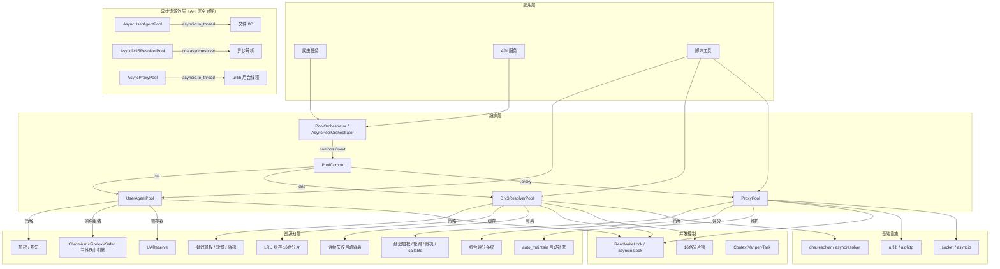

# 生产环境部署指南

> 适用版本：v1.2.3+ | 最后更新：2026-05-28

本指南覆盖 resource-pool 在生产环境中的配置、监控、排障和最佳实践。

---

## 1. 配置文件示例

推荐使用 TOML 格式管理三池配置，通过工厂函数从配置文件初始化。

### 1.1 完整配置 (`config.toml`)

```toml
# ============================================================
# resource-pool 生产配置
# ============================================================

[ua_pool]
# 池级默认策略：weighted | uniform
strategy = "weighted"
# 线程安全（生产环境务必开启）
thread_safe = true

[ua_pool.fake_useragent]
# 是否使用 fake_useragent 扩充 UA 数据库
# 在线路径：fake_useragent 可用时取其 UA + 派系引擎组装请求头
# 本地降级：返回 UA 数量 < 5 时自动降级到内置 ua_seeds.json（已自动加载 854 条）
enabled = false
browsers = ["chrome", "firefox", "safari", "edge"]
os = ["windows", "macos", "linux"]
limit = 100

[ua_pool.file_import]
# 从 JSON/CSV 文件批量导入
enabled = false
paths = []

[dns_pool]
# 地域：domestic | overseas
regions = ["domestic", "overseas"]
# 解析策略：latency_weighted | round_robin | random
strategy = "latency_weighted"
# 缓存 TTL（秒）
cache_ttl = 300
# 最大缓存条目
max_cache_size = 4096
# 连续失败阈值（触发隔离）
max_consecutive_fails = 3
# 隔离复活时间（秒）
revive_after = 120
thread_safe = true

[proxy_pool]
# 代理选取策略：latency_weighted | round_robin | random
strategy = "latency_weighted"
# 连续失败阈值
max_consecutive_fails = 5
# 隔离复活时间
revive_after = 300
# 存活代理下限（触发自动补充）
min_alive = 10
# 自动补充源 URL
auto_refill_url = ""
# 代理验证目标（用于健康检查）
validation_targets = ["http://httpbin.org/ip", "https://www.baidu.com"]
thread_safe = true

[orchestrator]
# 是否启用编排器
enabled = false
# 参与编排的池类型（默认：ua + dns + proxy）
pools = ["ua", "dns", "proxy"]
```

### 1.2 工厂函数示例（同步版）

```python
import tomllib
from user_agent_pool import UserAgentPool, UAStrategy
from dns_resolver_pool import DNSResolverPool, SelectStrategy
from proxy_pool import ProxyPool, ProxyStrategy


def create_pools_from_config(config_path: str = "config.toml"):
    """从 TOML 配置文件初始化三池"""
    with open(config_path, "rb") as f:
        cfg = tomllib.load(f)

    ua_cfg = cfg.get("ua_pool", {})
    ua_pool = UserAgentPool(
        strategy=UAStrategy(ua_cfg.get("strategy", "weighted")),
        thread_safe=ua_cfg.get("thread_safe", True),
        data_dir=ua_cfg.get("data_dir"),          # 养成数据目录（可选）
        load_builtin=ua_cfg.get("load_builtin", True),
        load_fed=ua_cfg.get("load_fed", True),    # 是否加载养成条目
    )

    dns_cfg = cfg.get("dns_pool", {})
    dns_pool = DNSResolverPool(
        regions=tuple(dns_cfg.get("regions", ["domestic", "overseas"])),
        strategy=SelectStrategy(dns_cfg.get("strategy", "latency_weighted")),
        cache_ttl=dns_cfg.get("cache_ttl", 300),
        max_consecutive_fails=dns_cfg.get("max_consecutive_fails", 3),
        revive_after=dns_cfg.get("revive_after", 120),
        thread_safe=dns_cfg.get("thread_safe", True),
        data_dir=dns_cfg.get("data_dir"),          # 养成数据目录（可选）
        load_builtin=dns_cfg.get("load_builtin", True),
        load_fed=dns_cfg.get("load_fed", True),
    )

    proxy_cfg = cfg.get("proxy_pool", {})
    proxy_pool = ProxyPool(
        strategy=ProxyStrategy(proxy_cfg.get("strategy", "latency_weighted")),
        max_consecutive_fails=proxy_cfg.get("max_consecutive_fails", 5),
        revive_after=proxy_cfg.get("revive_after", 300),
        thread_safe=proxy_cfg.get("thread_safe", True),
        min_alive=proxy_cfg.get("min_alive", 0),
        auto_refill_url=proxy_cfg.get("auto_refill_url", ""),
        data_dir=proxy_cfg.get("data_dir"),        # 养成数据目录（可选）
        load_builtin=proxy_cfg.get("load_builtin", True),
        load_fed=proxy_cfg.get("load_fed", True),
    )

    return ua_pool, dns_pool, proxy_pool
```

### 1.3 工厂函数示例（异步版）

```python
import tomllib
from user_agent_pool.pool_async import AsyncUserAgentPool
from dns_resolver_pool.pool_async import AsyncDNSResolverPool
from proxy_pool.pool_async import AsyncProxyPool, ProxyStrategy as AsyncProxyStrategy
from user_agent_pool.pool import UAStrategy
from dns_resolver_pool.pool import SelectStrategy


async def create_async_pools_from_config(config_path: str = "config.toml"):
    """从配置文件初始化异步三池"""
    with open(config_path, "rb") as f:
        cfg = tomllib.load(f)

    ua_cfg = cfg.get("ua_pool", {})
    ua_pool = AsyncUserAgentPool(
        strategy=UAStrategy(ua_cfg.get("strategy", "weighted")),
        thread_safe=ua_cfg.get("thread_safe", True),
        data_dir=ua_cfg.get("data_dir"),
        load_builtin=ua_cfg.get("load_builtin", True),
        load_fed=ua_cfg.get("load_fed", True),
    )

    dns_cfg = cfg.get("dns_pool", {})
    dns_pool = AsyncDNSResolverPool(
        regions=tuple(dns_cfg.get("regions", ["domestic", "overseas"])),
        strategy=SelectStrategy(dns_cfg.get("strategy", "latency_weighted")),
        cache_ttl=dns_cfg.get("cache_ttl", 300),
        max_consecutive_fails=dns_cfg.get("max_consecutive_fails", 3),
        revive_after=dns_cfg.get("revive_after", 120),
        thread_safe=dns_cfg.get("thread_safe", True),
        data_dir=dns_cfg.get("data_dir"),
        load_builtin=dns_cfg.get("load_builtin", True),
        load_fed=dns_cfg.get("load_fed", True),
    )

    proxy_cfg = cfg.get("proxy_pool", {})
    proxy_pool = AsyncProxyPool(
        strategy=AsyncProxyStrategy.LATENCY_WEIGHTED,
        max_consecutive_fails=proxy_cfg.get("max_consecutive_fails", 5),
        revive_after=proxy_cfg.get("revive_after", 300),
        min_alive=proxy_cfg.get("min_alive", 0),
        auto_refill_url=proxy_cfg.get("auto_refill_url", ""),
        thread_safe=proxy_cfg.get("thread_safe", True),
        data_dir=proxy_cfg.get("data_dir"),
        load_builtin=proxy_cfg.get("load_builtin", True),
        load_fed=proxy_cfg.get("load_fed", True),
    )

    return ua_pool, dns_pool, proxy_pool
```

---

## 2. 监控指标

### 2.1 关键指标

| 指标 | 获取方式 | 含义 | 告警阈值建议 |
|------|---------|------|:--:|
| **UA 池容量** | `pool.count()` | 各分类可用 UA 数 | 任一分 < 3 条 |
| **DNS 可用率** | `pool.stats()` 中 enabled=True 计数 | 可用 DNS 比例 | < 50% |
| **DNS 延迟** | `pool.stats()` 中 latency_ms | 平均解析延迟 | > 500ms |
| **代理存活率** | `len(pool._get_alive()) / len(pool._proxies)` | 可用代理比例 | < 30% |
| **代理评分** | `pool.scores()` | 代理质量分布 | 中位数 < 40 |
| **DNS 缓存命中率** | `len(pool._cache) / pool._max_cache_size` | 缓存利用率 | < 10% 或 > 90% |
| **编排器组合数** | `len(list(orchestrator.combos()))` | 可用组合数 | < 10 |
| **故障隔离数** | `stats()` 中 enabled=False 计数 | 被隔离节点数 | > 总数的 50% |

### 2.2 Prometheus 接入示例

```python
from prometheus_client import Gauge, start_http_server
import time

# ── 指标注册 ──
ua_count = Gauge("ua_pool_count", "UA count per category", ["category"])
dns_alive = Gauge("dns_pool_alive", "Alive DNS servers")
dns_latency = Gauge("dns_pool_latency_ms", "Avg DNS latency ms")
proxy_alive = Gauge("proxy_pool_alive", "Alive proxies")
proxy_score = Gauge("proxy_pool_score_median", "Median proxy score")
dns_cache_size = Gauge("dns_cache_size", "DNS cache entries")


def collect_metrics(ua_pool, dns_pool, proxy_pool):
    """定期采集指标（建议在后台线程中运行）"""
    while True:
        # UA 池
        for cat, count in ua_pool.count().items():
            ua_count.labels(category=cat).set(count)

        # DNS 池
        stats = dns_pool.stats()
        alive_count = sum(1 for s in stats if s["enabled"])
        dns_alive.set(alive_count)
        latencies = [s["latency_ms"] for s in stats if s["latency_ms"] > 0]
        if latencies:
            dns_latency.set(sum(latencies) / len(latencies))

        # 代理池
        proxy_alive.set(len(proxy_pool._get_alive()))
        scores = proxy_pool.scores()
        if scores:
            proxy_score.set(sorted(scores, key=lambda x: x[1])[len(scores)//2][1])

        # DNS 缓存
        dns_cache_size.set(len(dns_pool._cache))

        time.sleep(30)


# 启动
start_http_server(8000)
# threading.Thread(target=collect_metrics, args=(ua, dns, proxy), daemon=True).start()
```

---

## 3. 常见问题排查指南

### Q1：代理全部被隔离，报 PoolExhaustedException

**原因**：`max_consecutive_fails` 阈值过低或代理源质量差。

**排查**：
```python
# 查看隔离原因
pool.stats()  # 检查 fail_count 和 consecutive_fails

# 手动复活
for s in pool._proxies:
    if not s.enabled:
        s.enabled = True
        s.consecutive_fails = 0
```

**修复**：
- 调高 `max_consecutive_fails` 到 5-8
- 设置 `min_alive` + `auto_refill_url` 自动补充
- 调用 `pool.auto_maintain(timeout=10)` 定期维护

### Q2：高并发下 UA `reserve()` 泄漏

**原因**：并发数超过池容量，TOCTOU 竞态。

**排查**：
```python
# 检查池容量和并发比例
print(pool.count())  # 每分类数量
```

**修复**：
- 确保并发数 ≤ 池容量（或使用独立池实例）
- 对关键场景用 `get()` + 手动归还替代 `reserve()`

### Q3：DNS 解析变慢

**原因**：首选 DNS 延迟升高，或缓存率过低。

**排查**：
```python
stats = pool.stats()
for s in stats:
    if s["enabled"]:
        print(f"{s['ip']}: {s['latency_ms']}ms")
```

**修复**：
- 调高 `cache_ttl`（默认 300s）
- 调用 `pool.health_check()` 隔离慢节点
- 添加更多 DNS 服务器

### Q4：代理响应慢但未被隔离

**原因**：`latency_weighted` 策略仍在考虑延迟较高的代理。

**排查**：
```python
scores = pool.scores()
print("评分分布:", [(k, round(v, 1)) for k, v in scores[:10]])
```

**修复**：
- 调低 `max_consecutive_fails` 更快隔离
- 设置 `auto_maintain()` 自动淘汰低分代理
- 切换到 `round_robin` 策略均匀分配

### Q5：thread_safe=False 时仍想要部分线程安全

**说明**：`thread_safe=False` 是全局开关，无法局部启用。

**建议**：
- 单线程脚本使用 `thread_safe=False` 享受零开销
- 多线程场景务必开启 `thread_safe=True`
- 高性能场景可拆分独立池实例（每个线程一个池）

---

## 4. 架构图



### 4.1 锁层级说明（异步版）

```
高层（慢）：auto_maintain、load_from_url(s)、load_from_file、save_to_file、health_check
    │  持有时间：秒级，低频
    ▼
中层：add、remove、mark_failed（公共 API 层持 asyncio.Lock）
    │  持有时间：微秒-毫秒级，中频
    ▼
低层：_get_alive、_try_revive、_on_success（内部方法各自加锁，get 不持外层锁）
    │  持有时间：微秒级，高频。get() 仅在调用这些方法时短暂持锁，
    │  策略选择（排序/随机/轮询）在锁外执行，与同步版并发模型一致
    ▼
无锁：_do_resolve、_probe_proxy（I/O 密集，asyncio.to_thread 或原生异步 I/O）
```

> **设计变更（v1.0.4）**：`AsyncProxyPool.get()`/`get_dict()` 不再整个方法体持锁，
> 而是内部方法（`_get_alive`/`_try_revive`/`_on_success`/`_pick_one`）各自加锁，
> 选择逻辑在锁外执行。这与同步版 ProxyPool 的并发模型完全一致，
> 避免了之前 `async with self._lock` 包裹整个 get() 导致的协程串行化问题。
> 文件 I/O 和 HTTP 请求通过 `asyncio.to_thread` 在后台线程执行，不阻塞事件循环。

### 4.2 锁层级说明（同步版）

```
高层（慢）：automaintain、load_from_url、health_check
    │  持有时间：秒级，低频
    ▼
中层：add、remove、mark_failed（写锁）
    │  持有时间：微秒-毫秒级，中频
    ▼
低层：get、get_headers、resolve、get_dict（读锁）
    │  持有时间：微秒级，高频
    ▼
无锁：_do_resolve、_probe_server（I/O 密集）
```

读锁允许多线程并发进入，写锁独占。写者优先避免饥饿。

---

## 5. 性能调优清单

| 场景 | 优化建议 |
|------|---------|
| UA 池读多写少 | 使用默认 ReadWriteLock，无需调整 |
| DNS 高并发解析 | 增大 `cache_ttl`、提升 `max_cache_size` |
| 代理池初始化慢 | 分批 `load_from_urls()`，控制并发拉取数 |
| 数百线程并发 | 拆分为每个线程组共享一个池实例 |
| 异步场景 | 使用 `Async*` 版本，避免混用同步/异步锁 |
| 单线程脚本 | 设置 `thread_safe=False` 消除锁开销 |
| 代理质量差 | 启用 `auto_maintain()`、设置 `min_alive` |
| 内存压力大 | 降低 DNS `max_cache_size`、定期 `clear_cache()` |

---

## 6. 养成数据管理

养成 API 将资源持久化到安装目录，生产环境需注意备份和恢复策略。

### 6.1 定时备份养成数据

```python
import resource_pool, shutil, os
from datetime import datetime

# ── 导出养成数据到独立备份目录 ──
backup_dir = f"./backup/{datetime.now().strftime('%Y%m%d_%H%M%S')}"
os.makedirs(backup_dir, exist_ok=True)

for pool_type in ("ua", "proxy", "dns"):
    path = resource_pool.export_fed(pool_type, backup_dir)
    if path:
        print(f"✓ {pool_type}: {path}")
    else:
        print(f"- {pool_type}: 无养成数据")

# ── 查看统计 ──
print(resource_pool.status())
```

### 6.2 验证养成代理质量

```python
# 验证所有养成代理的连通性（三次测试，不通过自动导出失败列表）
import resource_pool

# 单代理探测
ok, detail = resource_pool.probe_proxy("1.2.3.4:8080", timeout=5)
print(f"探测结果: {'可用' if ok else '不可用'} — {detail}")

# 批量验证养成代理
result = resource_pool.validate_fed_proxies(
    retries=3, timeout=5, export_failures=True,
)
print(f"验证完成: 通过 {result['passed']}, 失败 {result['failed']}, 导出到 {result.get('export_path', 'N/A')}")
```

### 6.3 恢复养成数据

```python
# 恢复代理养成数据：创建 Pool → import → health_check
from proxy_pool import ProxyPool

pool = ProxyPool()
pool.import_proxy(backup_data["items"])  # 从导出文件读取的 JSON
pool.health_check()
```

### 6.4 注意事项

| 场景 | 说明 |
|------|------|
| pip upgrade | 养成数据写入安装目录，`pip install --upgrade` 会覆盖——**升级前务必 `export_fed()` 备份** |
| 多进程 | 每个子进程独立调用 `feed_*()`，数据文件写入是原子的（先写 `.tmp` 再 rename） |
| 跨项目共享 | 使用 `resource_pool.export_fed("proxy", "/shared/")` 导出 → 另一台机器 `import_proxy()` 导入 |
| 清除养成 | `resource_pool.reset("proxy")` 仅清除 fed 条目，内置数据不受影响 |

---

## 7. 升级清单

从 v0.7.0 升级到后续版本时的检查点：

- [x] 同步 API 向后兼容（`get`/`get_headers`/`resolve`/`get_dict` 不变）
- [x] 异步 API 独立命名空间（`Async*` 类不冲突）
- [x] `thread_safe` 参数默认 True
- [x] 异常类 `PoolExhaustedException` / `ResourceUnhealthyException` 不变
- [x] 派系即时组装为透明增强，不影响现有 profile 指定行为（优先级 ③）
